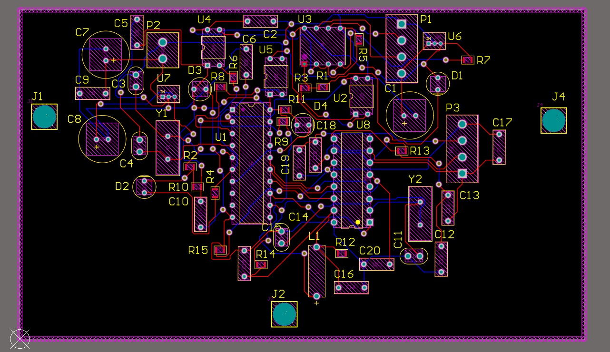

University: Technical University of Cluj-Napoca  
Course: The technology of electronic microsystems    
Author: Daniil Zabunov  
Year: 2022  
 
# Water Level and Pressure Monitoring System for Dam Infrastructure   

This project consists of a PCB design for a water level and pressure monitoring system, specifically developed for dam infrastructure applications.  
The system is designed to monitor water levels and detect potential pressure points on the materials used in dam construction. This system is intended to ensure safe and stable operation by providing real-time data on critical measurements.  

## Project Overview  

The PCB design includes the following key components:  

-ATtiny2313 Microcontroller: Responsible for managing sensor data and communication protocols.  
-AD7705 Analog-to-Digital Converter (ADC): Utilized for precise conversion of sensor analog signals to digital, enabling accurate water level and pressure measurements.  
-RS485 Communication Interface: Allows data transmission over long distances, which is essential for industrial applications where the monitoring station may be far from the data collection point.  
-Optocouplers (LTV-816): Ensure galvanic isolation, enhancing the durability and safety of the circuit in high-noise industrial environments.  
-LM7805 Voltage Regulator: Provides stable 5V output for components, converting from an input voltage of 12V.  

## Schematic Description  

The system operates by receiving data from a water level and pressure sensor connected to the PCB.  
The sensor data is then converted from analog to digital signals using the AD7705 ADC. The ATtiny2313 microcontroller processes this data and transmits it through the RS485 communication protocol.  
This setup is optimized for use in dam infrastructure, where it is crucial to monitor water pressure and levels accurately to ensure structural integrity.  

## Key Functional Blocks  

-Microcontroller (ATtiny2313): Processes the data and manages RS485 communication.  
-Analog-to-Digital Converter (AD7705): Ensures high-precision measurement, crucial for detecting slight changes in pressure and water levels.  
-Optocouplers: Isolate the microcontroller and other sensitive components from potential interference.  
-Power Supply: The LM7805 regulator maintains a stable 5V supply, necessary for reliable operation of the digital and analog components.  
-Design Challenges and Rule Violations  
-During the PCB design process, several rule violations were identified. These are summarized below, along with explanations and potential solutions:  

## Summary of Rule Violations  

| Rule                          | Constraint                            | Violations |
|-------------------------------|---------------------------------------|------------|
| Hole Size Constraint          | Min = 0.025mm, Max = 2.54mm           | 3          |
| Minimum Solder Mask Sliver    | Gap = 0.254mm                         | 7          |
| Silk To Solder Mask Clearance | Clearance = 0.254mm                   | 124        |
| Silk to Silk Clearance        | Clearance = 0.254mm                   | 4          |
| Height Constraint             | Min = 0mm, Max = 25.4mm, Preferred = 12.7mm | 0          |

## Explanation of Rule Violations  

-Silk To Solder Mask Clearance: There are 124 violations where the silkscreen (text and markings) is too close to the solder mask layer.  
This issue occurred due to space constraints and high component density.  
To address this, the text and symbols on the silkscreen can be repositioned to ensure a safe distance from the solder mask layer.    

-Minimum Solder Mask Sliver: Some areas of the solder mask are too thin, which could lead to exposure of copper traces.    
This can be solved by adjusting the solder mask clearance settings in the PCB design software.   

-Hole Size Constraint: This rule ensures that the hole sizes are within manufacturing tolerances.  
Three violations were noted, likely due to the use of non-standard via or pad sizes. Adjusting the hole sizes to match standard manufacturing specifications will resolve this.  

-Silk to Silk Clearance: There are four instances where silk elements overlap or are too close.  
This is typically a minor issue that can be fixed by adjusting the position of the text or symbols.  

## Future Improvements  

Optimize Component Layout: Re-evaluate the layout to minimize rule violations, especially by improving silkscreen placement.  
Adjust Clearance Rules: Update the design rules to meet manufacturing standards more accurately and minimize violations.  
Enhanced Testing and Validation: Perform additional testing to ensure that adjustments do not compromise the functionality or manufacturability of the PCB.  

## Getting Started

To view or modify this project, you will need:
Altium Designer: To open and edit the PCB design files.  
Basic knowledge of electronic circuits and PCB design rules.  

## Skills Demonstrated

This project showcases skills in:
PCB design and layout optimization, considering practical industrial constraints.  
Understanding of high-precision analog-to-digital conversion for sensor applications.  
Experience with communication protocols such as RS485, suitable for industrial settings.  
Proficiency in adhering to design rules and resolving rule violations to ensure manufacturability.  

## License  

This project is open-source and is licensed under the MIT License.  
